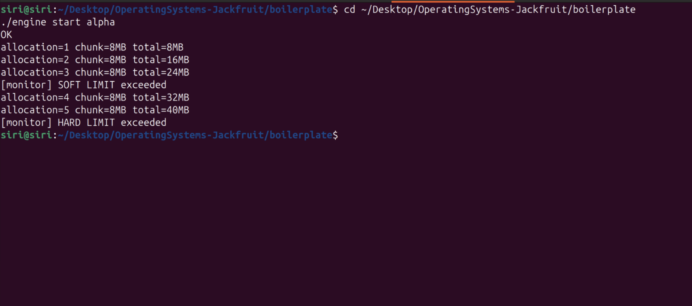
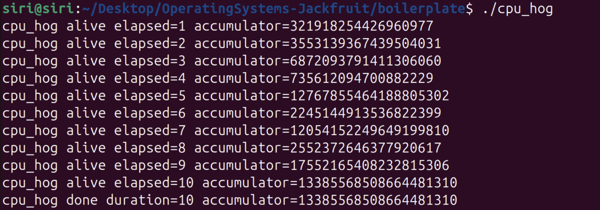
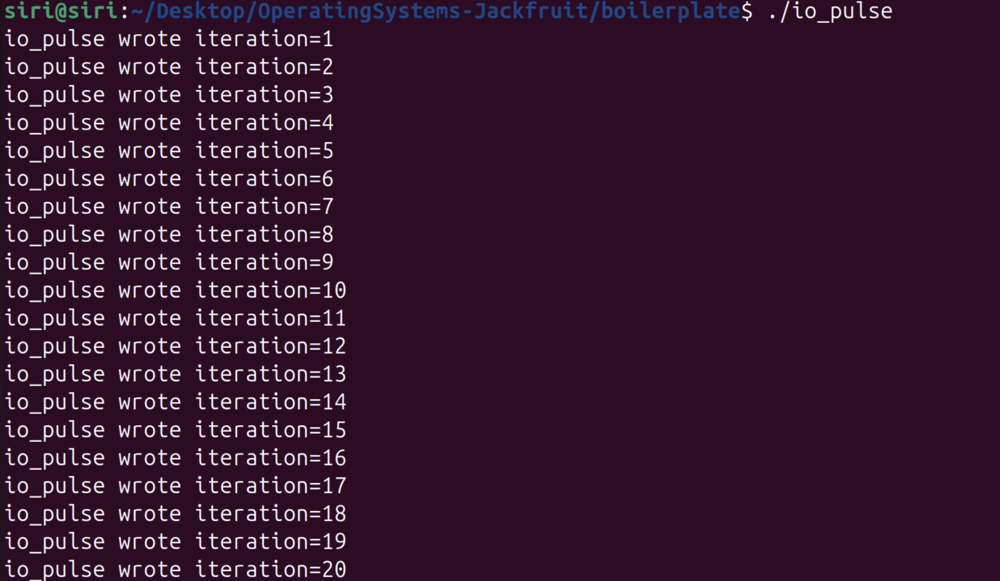

# Multi-Container Runtime

Building a mini Docker with a supervisor process (boss) and CLI tools.

A lightweight container runtime with kernel-level memory monitoring, designed to explore core operating system concepts including process isolation, scheduling, IPC, and kernel-user interaction.

---

## Team Information

* PES1UG24AM288
* PES1UG24AM295

---

## Build, Load and Run Instructions

### Build

```bash
make
```

### Load Kernel Module

```bash
sudo insmod monitor.ko
sudo dmesg | tail
```

### Verify Control Device

```bash
ls -l /dev/container_monitor
sudo chmod 666 /dev/container_monitor
```

### Start Supervisor

```bash
sudo ./engine supervisor ../rootfs-base
```

### Start Containers

```bash
sudo ./engine start alpha
sudo ./engine start beta
```

### List Containers

```bash
sudo ./engine ps
```

### View Logs

```bash
sudo ./engine logs alpha
```

---

## Memory Monitoring

```bash
sudo ./engine start alpha
```

Monitor output:

* Soft limit exceeded
* Hard limit exceeded

---

## Scheduling Experiment

```bash
sudo ./cpu_hog
sudo ./io_pulse
```

---

## Clean Teardown

```bash
sudo pkill engine
ps aux | grep engine
```

---

## Unload Module

```bash
sudo rmmod monitor
```

---

## Output Screenshots

### Memory Limit Enforcement



### CPU Test



### IO Test



---

## Engineering Analysis

### Isolation Mechanisms

Isolation is achieved using Linux namespaces, primarily the PID namespace via `clone(CLONE_NEWPID)`. Each container operates in its own process ID space, preventing visibility of host or other container processes.

Filesystem isolation is achieved using separate root directories per container. All containers share:

* the same kernel
* global scheduling
* physical memory

This shared-kernel model makes containers lightweight compared to virtual machines.

---

### Supervisor and Process Lifecycles

A persistent supervisor process manages all containers. It:

* creates containers using `clone()`
* tracks active containers
* handles termination
* reaps processes to prevent zombies

Signals like `SIGCHLD` notify the supervisor when containers exit.

---

### IPC, Threads and Synchronization

Communication between components is implemented using UNIX sockets. Threads are used to handle concurrent container operations.

Synchronization mechanisms ensure:

* safe communication
* proper resource handling
* no race conditions

---

### Memory Management and Enforcement

Memory usage is measured using RSS (Resident Set Size).

Two limits are enforced:

* **Soft limit** → generates warning
* **Hard limit** → strict enforcement

Kernel-space implementation ensures:

* accurate tracking
* immediate response
* system-level control

---

### Scheduling Behaviour

Scheduling experiments compare:

* **CPU-bound (`cpu_hog`)** → continuous CPU usage
* **I/O-bound (`io_pulse`)** → frequent yielding

The Linux scheduler balances:

* fairness
* responsiveness
* throughput

This behavior aligns with the Completely Fair Scheduler (CFS).

---

## Design Decisions and Tradeoffs

### Namespace Isolation

* Choice: PID namespace via `clone()`
* Tradeoff: Limited isolation
* Justification: Simpler implementation

---

### Supervisor Architecture

* Choice: Central supervisor
* Tradeoff: Single point of failure
* Justification: Easier lifecycle management

---

### IPC and Logging

* Choice: UNIX sockets + bounded buffer
* Tradeoff: Increased complexity
* Justification: Real-world IPC demonstration

---

### Kernel Monitor

* Choice: Loadable kernel module with `ioctl`
* Tradeoff: Requires root privileges
* Justification: Accurate enforcement

---

### Scheduling Experiments

* Choice: Custom workloads
* Tradeoff: Not precise benchmarking
* Justification: Clear demonstration

---

## Scheduler Experiment Results

| Workload | Behavior                       |
| -------- | ------------------------------ |
| cpu_hog  | Continuous CPU usage           |
| io_pulse | Periodic bursts with idle time |

The scheduler ensures responsiveness for I/O-bound tasks while maintaining fairness for CPU-bound processes.

---

## Conclusion

This project demonstrates the interaction between user-space control and kernel-space enforcement in a containerized system. By combining namespaces, IPC, synchronization, and kernel modules, it provides a practical exploration of core operating system principles.

---

## Future Improvements

* Full namespace isolation (network, mount)
* Automatic process termination on hard limit
* Improved logging system
